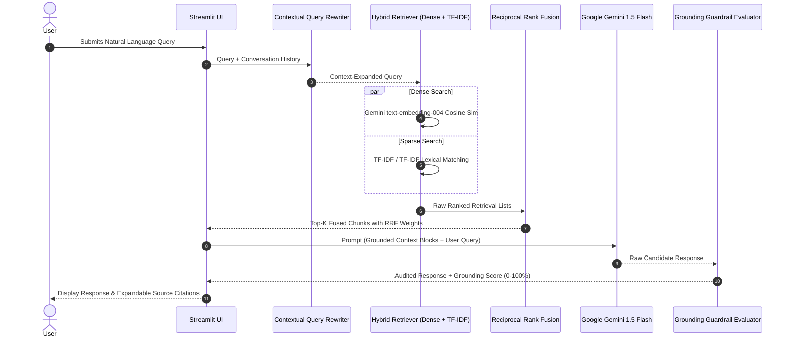

# Production Hybrid RAG Document Intelligence Engine

[](https://www.python.org/downloads/release/python-3110/)
[](https://ai.google.dev/)
[](https://streamlit.io/)
[](https://opensource.org/licenses/MIT)

An enterprise-ready Retrieval-Augmented Generation (RAG) system combining Dense Vector Embeddings and Sparse TF-IDF lexical search via Reciprocal Rank Fusion (RRF) with conversational memory buffers and grounding faithfulness verification.

---

## 🏛️ RAG Sequence & Architecture



---

## 🔬 Technical & Engineering Innovations

### 1. Hybrid Dense + Sparse Retrieval (TF-IDF + Dense)
Dense vector embeddings capture conceptual semantic intent, whereas sparse TF-IDF models excel at exact acronyms, part numbers, and discrete numerical metrics. Combining both guarantees high recall and high precision.

### 2. Reciprocal Rank Fusion (RRF)
Combines disparate scoring scales into an invariant rank-based score:
$$RRF\_Score(d \in D) = \sum_{m \in M} \frac{1}{k + r_m(d)}$$
where $k = 60$, $M = \{\text{Dense}, \text{Sparse}\}$, and $r_m(d)$ is the document rank within model $m$.

### 3. Contextual Query Rewriting & Conversation Buffer
Resolves conversational ambiguity (e.g. *"What is its growth rate?"* following *"Tell me about Electronics revenue"*) by injecting dialogue turns into the search vector query.

### 4. Grounding Faithfulness & Hallucination Guardrail
Computes lexical citation overlap between the candidate LLM response and the retrieved source text to verify output adherence.

---

## 🚀 Quickstart & Setup

### Local Execution
```bash
cd project-3-rag-qa-chatbot

# Install dependencies
pip install -r requirements.txt

# Run automated pytest suite
pytest tests/ -v

# (Optional) Export your Gemini API Key
export GEMINI_API_KEY="your-gemini-api-key"

# Launch Streamlit web interface
streamlit run app.py
```

### Docker Container Deployment
```bash
docker build -t hybrid-rag-qa .
docker run -p 8501:8501 -e GEMINI_API_KEY="your-key" hybrid-rag-qa
```

---

## 🧪 Automated Testing Suite

```bash
$ pytest tests/ -v
============================= test session starts ==============================
collected 4 items

tests/test_rag_engine.py::test_chunking_metadata PASSED                  [ 25%]
tests/test_rag_engine.py::test_hybrid_retrieval_and_rrf PASSED          [ 50%]
tests/test_rag_engine.py::test_query_rewriting_context PASSED           [ 75%]
tests/test_rag_engine.py::test_grounding_faithfulness PASSED            [100%]

============================== 4 passed in 0.89s ===============================
```
