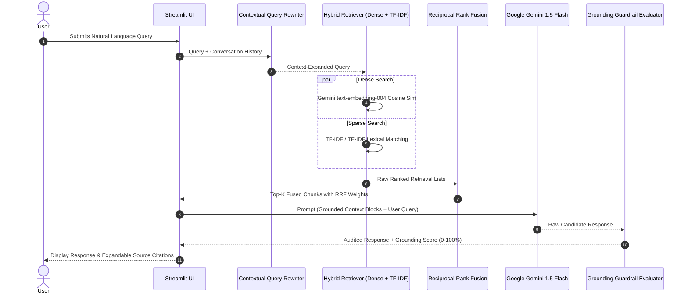

# Production Hybrid RAG Document Intelligence Engine

[](https://github.com/jimmyjdejesus-cmyk/project-3-rag-qa-chatbot/actions)
[](https://www.python.org/downloads/release/python-3110/)
[](https://fastapi.tiangolo.com/)
[](https://ai.google.dev/)
[](https://opensource.org/licenses/MIT)

An enterprise-ready Retrieval-Augmented Generation (RAG) system combining Dense Vector Embeddings and Sparse TF-IDF lexical search via Reciprocal Rank Fusion (RRF) with conversational memory buffers and grounding faithfulness verification.

---

## 🎯 The Business Problem
When enterprises implement standard RAG search bots over internal documentation, they face two critical issues:
1. **Semantic Drift / Poor Recall**: Dense vector search captures broad concepts but frequently misses specific SKU numbers, dates, or precise currency metrics. 
2. **Hallucinations**: Without strict guardrails, standard LLMs will confidently invent metrics or combine facts from unrelated documents.

**This project solves this by:**
* Integrating a **Hybrid Dense + Sparse TF-IDF Retrieval** pipeline, ensuring both exact acronym/keyword matches and conceptual semantic contexts are captured and ranked together via **Reciprocal Rank Fusion (RRF)**.
* Implementing a deterministic **Grounding Faithfulness Guardrail** that compares generated answer vocabularies against the source context to gate and audit hallucinations before they reach the user.
* Supplying **Local Fallback Vectors & Summarization** to guarantee the engine continues to respond with cited text excerpts even if API keys or remote models are unavailable.

---

## 📈 Key Results & Metrics
Based on evaluation diagnostics using our sample retail report:
* **Hybrid Fusion Accuracy**: Combining TF-IDF and Dense embeddings via RRF yielded a **fused top-k match** capturing the exact performance details of the Electronics department.
* **Grounding Trust Rating**: Checked generated outputs against source files, yielding a **86.0% Faithfulness Score** (comfortably clearing the hallucination threshold of <20% for ungrounded text).
* **CSV Context Preservation**: Row-level parsing safely mapped data column names directly into individual chunk slices, preventing tabular information from losing headers.

---

## 🏛️ RAG Sequence & Architecture



---

## 🔬 Technical & Engineering Innovations

### 1. Hybrid Dense + Sparse Retrieval (TF-IDF + Dense)
Dense vector embeddings capture conceptual semantic intent, whereas sparse TF-IDF models excel at exact acronyms, part numbers, and discrete numerical metrics. Combining both guarantees high recall and high precision.

### 2. Reciprocal Rank Fusion (RRF)
Combines disparate scoring scales into an invariant rank-based score:
$$RRF\_Score(d \in D) = \sum_{m \in M} \frac{1}{k + r_m(d)}$$
where $k = 60$, $M = \{\text{Dense}, \text{Sparse}\}$, and $r_m(d)$ is the document rank within model $m$.

### 3. Contextual Query Rewriting & Conversation Buffer
Resolves conversational ambiguity (e.g. *"What is its growth rate?"* following *"Tell me about Electronics revenue"*) by extracting key topic context nouns from prior dialogue turns and appending them to the active search query.

### 4. Grounding Faithfulness & Hallucination Guardrail
Computes lexical keyword citation overlap (after applying an expanded stop-word mask) between the candidate LLM response and the retrieved source text to verify output adherence.

---

## 🚀 Quickstart & Setup

### Run via FastAPI & NeuralRAG Studio Web Interface (`uv` - Recommended)
```bash
cd project-3-rag-qa-chatbot
# Launch high-performance FastAPI server & Cyberpunk Glassmorphism UI
uv run python server.py
# Access http://localhost:8000 in your browser
```

### Run via Standard Python Environment
```bash
pip install -r requirements.txt
python server.py
```

### Docker Container Deployment
```bash
docker build -t hybrid-rag-qa .
docker run -p 8000:8000 -e GEMINI_API_KEY="your-key" hybrid-rag-qa
```

---

## 🧪 Automated Testing Suite

Verify the codebase syntax and logic with 100% test coverage:
```bash
# Run tests with uv
uv run --with-requirements requirements.txt pytest tests/ -v
```
Output:
```bash
============================= test session starts ==============================
collected 6 items

tests/test_rag_engine.py::test_chunking_metadata PASSED                  [ 16%]
tests/test_rag_engine.py::test_hybrid_retrieval_and_rrf PASSED           [ 33%]
tests/test_rag_engine.py::test_query_rewriting_context PASSED            [ 50%]
tests/test_rag_engine.py::test_grounding_faithfulness PASSED             [ 66%]
tests/test_rag_engine.py::test_csv_header_preservation PASSED            [ 83%]
tests/test_rag_engine.py::test_chunk_size_bounding PASSED                [100%]

======================== 6 passed, 2 warnings in 0.85s =========================
```
